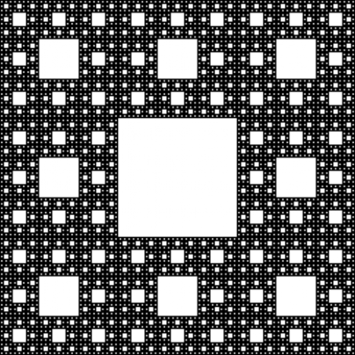
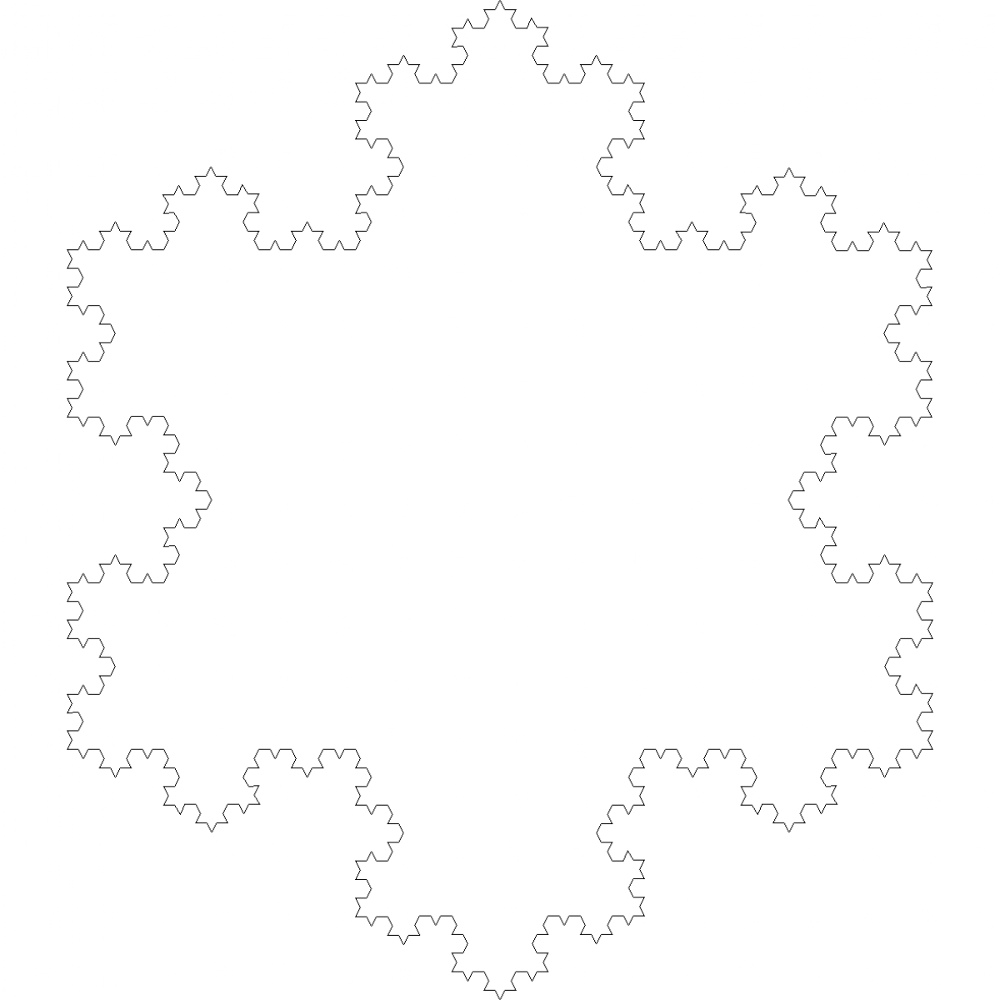

# Fractal

[](https://github.com/kolbacer/MSDTT/actions/workflows/cmake.yml)

A pure C program that can generate fractals:
- Empty fractal
- Sierpinski carpet
- Koch snowflake & Koch curve

And save them in PGM format.

## Prerequisites
- `CMake 3.5+`
- `some C compiler`

## Usage
### Configure
In project root:
```console
usr:~/03.A.Fractal$ mkdir build
usr:~/03.A.Fractal$ cd build
usr:~/03.A.Fractal/build$ cmake ..
```
### Build
```console
usr:~/03.A.Fractal/build$ cmake --build .
```
### Run example
```console
usr:~/03.A.Fractal/build$ ./03_A_Fractal
```
## Examples
Sierpinski carpet:



Koch snowflake:



## Project structure
```
.
├── Readme.md - project description
├── examples/ - foolder with examples
├── CMakeLists.txt - CMake configuration file
├── main.c - entry point
├── include - headers
│   ├── fractal.h
│   └── image.h
└── src
    ├── fractals - fractals source code
    │   ├── empty.c
    │   ├── koch.c
    │   └── sierpinski.c
    └── image.c - base image utils
```